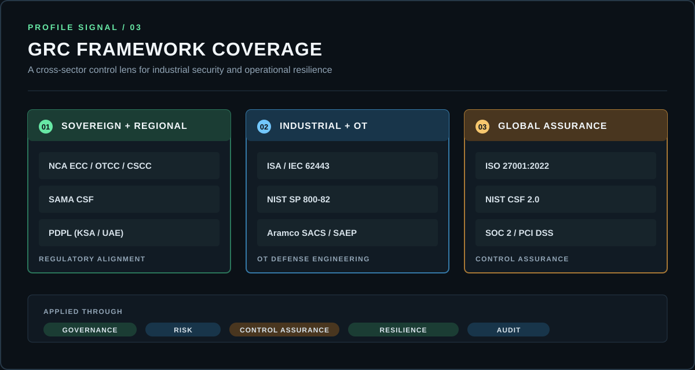

<p align="center">
  
</p>

<p align="center">
  <a href="https://jamilahmed.net"></a>
  <a href="https://www.linkedin.com/in/jamilahmed-cs/"></a>
  
</p>

---

### 📂 SYSTEM_MANIFEST.sh
```zsh
> INITIALIZING_SECURE_CONNECTION...
> SUBJECT: JAMIL AHMED
> ROLE:    Senior Cybersecurity Consultant (OT/IT)
> MISSION: Empowering industrial continuity through integrated GRC, OT defense, and data-driven security analytics.
> SECTORS: [ENERGY] [FINANCE] [CRITICAL_INFRASTRUCTURE]
```

### 🛡️ Strategic GRC & Compliance Layer
*Expertise in designing risk-based security programs for sovereign and industrial assets.*

- **Sovereign Frameworks:** `NCA (ECC/OTCC/CSCC)` • `SAMA CSF` • `PDPL (KSA/UAE)`
- **Industrial Standards:** `ISA/IEC 62443` • `NIST SP 800-82` • `Aramco SACS/SAEP`
- **Global Governance:** `ISO 27001:2022` • `NIST CSF 2.0` • `SOC 2` • `PCI DSS`

### 🏗️ Infrastructure & Security Stack
<p align="left">
  <a href="https://jamilahmed.net">
    
    
    
    
    
    
    
    
    
    
    
    
  </a>
</p>

### 📈 Operational Readiness Matrix
| Capability | Description | Core Deliverables |
| :--- | :--- | :--- |
| **OT/ICS Defense** | SCADA, PLC, and DCS security hardening. | Risk-based remediation roadmaps. |
| **Operational Resilience** | Business continuity and resilience planning for critical infrastructure. | Continuity strategies and recovery roadmaps. |
| **Audit & Assurance** | ITGC Testing & IAM/RBAC Governance. | Audit-ready compliance documentation. |
| **GRC & Compliance** | Risk-based governance aligned with NCA, SAMA, ISO 27001, and NIST frameworks. | Compliance roadmaps and audit-ready evidence. |

### 🌍 Trusted Industry Impact
`Saudi Aramco` • `SASREF` • `Samsung E&A` • `STC (Sirar)` • `PDO Oman` • `Haramain Railway`

---

### 📊 GRC Framework Coverage Map
<p align="center">
  
</p>

### 📡 Secure Uplink & Connectivity
<p align="center">
  <a href="mailto:me@jamilahmed.net"></a>
  <a href="https://jamilahmed.net"></a>
  <a href="https://www.linkedin.com/in/jamilahmed-cs/"></a>
</p>

---
<p align="center">
  
</p>
